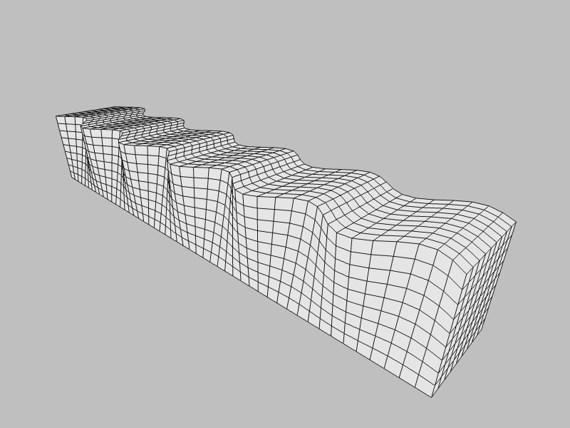

## Waves on Surfaces

Simulation of elastic waves on surfaces written in JavaScript and WebGL.

### Love Waves

Depiction of the propagation of a Love wave, named after
[Augustus Edward Hough Love](https://en.wikipedia.org/wiki/Augustus_Edward_Hough_Love).
The particles vibrate perpendicularly to the direction of propagation
and the amplitude decays with depth.
